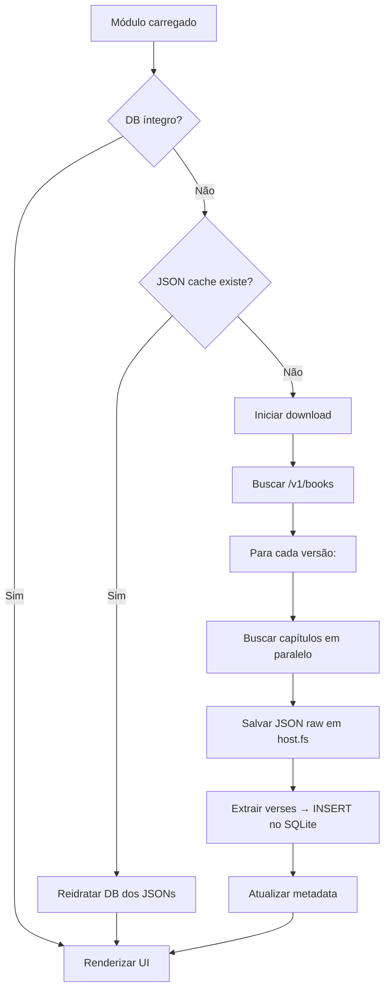

# Bible Module — Architecture Plan

## 1. Visão Geral

Módulo de Bíblia para Lumen com duas superfícies:

- **Overlay** (`host.overlay`): interface de controle do operador — grid de livros,
  navegação, busca, seleção de versículos. Janela destacada, independente.
- **Presenter** (`host.presentation`): saída para o público — exibe o texto
  selecionado com fonte grande, sem elementos de navegação.

Versões padrão: **NAA** (Nova Almeida Atualizada), **ARA** (Almeida Revista e
Atualizada) e **NVI** (Nova Versão Internacional). Futuramente podem ser
adicionadas mais. UI internacionalizada (PT, EN, ES). Os dados são baixados
da [API midvash](https://api.midvash.com) e armazenados localmente em SQLite
via `host.data.sqlite()`, com cache raw em JSON via `host.fs`.

---

## 2. Estrutura de Diretórios

```
src/
├── data/
│   ├── downloader.ts          # Download paralelo de traduções
│   ├── schema.ts              # Migrations SQLite
│   ├── store.ts               # Queries e operações no banco local
│   └── types.ts               # Tipos de dados da Bíblia
├── i18n/
│   ├── en.ts
│   ├── pt-BR.ts
│   └── es.ts                  # Suporte a espanhol
├── overlay/
│   ├── BibleController.tsx     # Painel principal do overlay (grid de livros + leitura)
│   ├── BookGrid.tsx            # Grid de livros estilo tabela periódica
│   ├── ChapterReader.tsx       # Leitor de capítulo (sidebar do overlay)
│   ├── VersionSelector.tsx     # Seletor de versão
│   ├── QuickSearch.tsx         # Busca rápida por inicial do livro / "gn 1"
│   ├── DownloadProgress.tsx    # Barra de progresso discreta no topo
│   └── SearchPanel.tsx         # Painel de busca textual completa
├── presenter/
│   └── BibleSlide.tsx          # Slide do presenter (texto grande para o público)
├── commands.ts                 # Registro de comandos da palette
├── i18n.ts
├── main.ts                     # Entry point do plugin
└── styles.css
```

---

## 3. Schema SQLite

```sql
-- Migration 1: verses
CREATE TABLE verses (
  id        INTEGER PRIMARY KEY AUTOINCREMENT,
  version   TEXT NOT NULL,            -- 'naa', 'arc', 'ara', 'acf', 'as21', 'aa', 'jfaa'
  book      TEXT NOT NULL,            -- slug do livro: 'genesis', 'exodus', etc.
  chapter   INTEGER NOT NULL,
  verse     INTEGER NOT NULL,
  text      TEXT NOT NULL,
  UNIQUE(version, book, chapter, verse)
);

CREATE INDEX idx_verses_version_book_chapter
  ON verses(version, book, chapter);

-- Migration 2: metadata
CREATE TABLE metadata (
  key   TEXT PRIMARY KEY,
  value TEXT NOT NULL
);
-- Guarda: last_download, versions_downloaded (JSON array), etc.

-- Migration 3: search_index (FTS5)
CREATE VIRTUAL TABLE verses_fts USING fts5(
  text,
  version UNINDEXED,
  book    UNINDEXED,
  chapter UNINDEXED,
  verse   UNINDEXED,
  content=verses,
  content_rowid=id
);

-- Triggers para manter FTS sincronizado
CREATE TRIGGER verses_ai AFTER INSERT ON verses BEGIN
  INSERT INTO verses_fts(rowid, text, version, book, chapter, verse)
  VALUES (new.id, new.text, new.version, new.book, new.chapter, new.verse);
END;
```

---

## 4. Data Layer

### 4.1. Tipos (`types.ts`)

```typescript
interface Book {
  id: string;          // slug: 'genesis'
  name: string;        // nome traduzido: 'Gênesis'
  chapters: number;    // total de capítulos
  testament: 'old' | 'new';
}

interface Version {
  id: string;          // 'naa', 'arc', ...
  name: string;        // 'Nova Almeida Atualizada'
  language: string;     // 'pt'
}

interface Chapter {
  version: string;
  book: string;
  number: number;
  verses: (Verse | null)[];  // índice 1-based, null = não existe
}

interface Verse {
  number: number;
  text: string;
}

interface SearchResult {
  version: string;
  book: string;
  chapter: number;
  verse: number;
  text: string;
  snippet: string;
}
```

### 4.2. Downloader (`downloader.ts`)

- Usa `host.net` para buscar as traduções da midvash.
- Meta: endpoints:
  - `GET /v1/versions` → lista de versões disponíveis
  - `GET /v1/books` → lista de livros (usar `?version=naa` — ou o endpoint aceita `?language=pt`)
  - `GET /v1/{version}/{book}/{chapter}` → capítulo individual
- Estratégia:
  1. Buscar lista de livros (1 request).
  2. Para cada versão, disparar requests paralelos para todos os capítulos.
  3. Usar `Promise.allSettled` com limite de concorrência (ex.: 20 simultâneos).
  4. Salvar JSON raw de cada capítulo em `host.fs` como backup (`{version}/{book}/{chapter}.json`).
  5. Extrair verses do JSON e inserir em lotes no SQLite via `INSERT OR IGNORE`.
  6. Responsividade: barra de progresso discreta no topo do overlay, emitindo
     `host.events.emit('download:progress', { version, current, total })`.
- Retry e resiliência:
  - Cada capítulo: 3 tentativas com backoff progressivo (1s, 3s, 5s).
  - Se falhar após 3 tentativas, marca como falha e notifica o usuário.
  - **Download resumível**: o JSON salvo em `host.fs` serve como checkpoint.
    Na próxima execução, capítulos com JSON existente são pulados (reidratados
    no DB localmente).
  - Se a midvash estiver fora, exibe notificação "Serviço indisponível" e
    oferece tentar novamente.
- Botão "Redownload" para forçar atualização (limpa JSON + DB e baixa de novo).

### 4.3. Store (`store.ts`)

```typescript
// Inicialização — verifica se DB precisa ser reidratado dos JSONs
async function initDB(db: SqliteHandle, fs: FsAPI): Promise<void>

// Download — baixa da midvash, insere no DB e salva JSON
async function downloadVersion(db: SqliteHandle, net: NetAPI, fs: FsAPI, versionId: string, books: Book[]): Promise<void>
async function downloadAll(db: SqliteHandle, net: NetAPI, fs: FsAPI, versions: string[]): Promise<void>

// Reidratação — se DB vazio mas JSON existe, recria sem baixar
async function rehydrateFromCache(db: SqliteHandle, fs: FsAPI, versionId: string, books: Book[]): Promise<boolean>

// Leitura
async function getChapter(db: SqliteHandle, version: string, book: string, chapter: number): Promise<Chapter>
async function getBookList(db: SqliteHandle): Promise<Book[]>

// Pesquisa
async function search(db: SqliteHandle, query: string, version?: string): Promise<SearchResult[]>
```

---

## 5. UI / Painéis

### 5.1. BibleController (Overlay `presenter.content`)

Slot: `'presenter.content'` — projetado via `host.overlay.project("bible-controller", { windowConfig, ... })`

A overlay abre maximizada, sem decorações, como se fosse um app à parte. Layout
dividido em duas colunas:

```
┌──────────────────────────────────────────────────────────┐
│  ████████████████░░░░░░░  Baixando NVI... (45%)         │ ← DownloadProgress (só aparece durante download)
├──────────────────────────────────────────────────────────┤
│  Bíblia  [NAA ▾]  [🔍 Buscar...]                        │ ← Top bar
├────────────────────────────┬─────────────────────────────┤
│                            │                             │
│  ┌────┐ ┌────┐ ┌────┐     │  Gênesis 1                  │
│  │ Gn │ │ Ex │ │ Lv │     │                             │
│  └────┘ └────┘ └────┘     │  1 No princípio, Deus       │
│  ┌────┐ ┌────┐ ┌────┐     │  criou os céus e a          │
│  │ Nm │ │ Dt │ │ Js │     │  terra.                     │
│  └────┘ └────┘ └────┘     │                             │
│  ┌────┐ ┌────┐ ┌────┐     │  2 A terra era sem          │
│  │ Jz │ │ Rt │ │ 1Sm │    │  forma e vazia...           │
│  └────┘ └────┘ └────┘     │                             │
│  ...               [AT ▼] │  [◀ 1] [2] [3] ... ▶]      │
│                            │                             │
│  Grid de livros estilo    │  Leitor do capítulo         │
│  tabela periódica         │  selecionado                │
│                            │                             │
├────────────────────────────┴─────────────────────────────┤
│   [⏎ Projetar Gênesis 1]  [📋 Copiar seleção]           │ ← Action bar
└──────────────────────────────────────────────────────────┘
```

**QuickSearch (type-to-filter):**
- Ao digitar qualquer tecla alfanumérica, abre um seletor no topo do overlay.
- Filtra livros por inicial ou nome parcial.
- Aceita comandos como `"gn"` → Gênesis, `"gn 1"` → Gênesis 1.
- Se for caractere único, mostra grid simplificado com os livros daquela inicial.
- Fecha ao clicar num livro ou pressionar Escape.

**Componentes do overlay:**

| Componente | Descrição |
|------------|-----------|
| `BookGrid` | Grid de botões com abreviações dos livros (Gn, Ex, Lv...), filtrado por testamento (AT/NT) |
| `ChapterReader` | Sidebar direita com o texto do capítulo selecionado, navegação entre capítulos |
| `VersionSelector` | Dropdown no topo para trocar versão ativa |
| `QuickSearch` | Busca rápida por inicial do livro / referência tipo "gn 1:2" |
| `DownloadProgress` | Barra discreta no topo durante download, visível mas não intrusiva |
| `SearchPanel` | Busca textual completa com resultados agrupados |

**Fluxo de uso:**
1. Operador cliqueia num livro no grid → `ChapterReader` carrega o capítulo 1
2. Ou digita a inicial do livro → `QuickSearch` abre sugestões
3. Navega pelos capítulos no leitor
4. Cliqueia "Projetar" → envia o texto para o presenter

### 5.2. BibleSlide (Presenter `presenter.content`)

Slot: `'presenter.content'` — projetado via `host.presentation.project("bible-slide", { version, book, chapter, verses })`

```
┌─────────────────────────────────────┐
│                                     │
│                                     │
│      Gênesis 1 — NAA               │ ← Referência (pequena)
│                                     │
│   1 No princípio, Deus criou       │
│     os céus e a terra.             │
│   2 A terra era sem forma e        │ ← Texto grande, centralizado
│     vazia; e as trevas cobriam     │
│     o abismo.                      │
│   3 Disse Deus: Haja luz; e        │
│     houve luz.                     │
│                                     │
│                                     │
│                                     │
└─────────────────────────────────────┘
```

- Fonte grande, contraste alto, sem distrações
- Referência no topo (Gênesis 1 — NAA)
- Versículos numerados
- Projetado no presenter (tela do público/projetor)

---

## 6. Integração com Lumen

### 6.1. Overlay (Controle)

```typescript
// Abrir a interface de controle da Bíblia
host.overlay.project("bible-controller", {
  windowConfig: {
    maximized: true,
    resizable: false,
    decorations: false,
    title: "Bíblia",
  },
});
```

Toda interação do operador acontece aqui: navegar livros, ler capítulos, buscar.

### 6.2. Presenter (Saída Pública)

```typescript
// Projetar um capítulo/versículo no presenter
host.presentation.project("bible-slide", {
  version: "naa",
  book: "genesis",
  bookName: "Gênesis",
  chapter: 1,
  verses: [1, 2, 3],   // verses específicos ou null = capítulo inteiro
  range: "1-3",         // label opcional: "vv. 1-3"
});

// Limpar o presenter
host.presentation.clear();
```

O presenter mostra apenas o texto limpo, sem UI de navegação.

### 6.3. Comandos (Command Palette)

| Comando | Ação |
|---------|------|
| `bible: open` | Abrir overlay da Bíblia |
| `bible: search [query]` | Abrir busca no overlay (com prefixo) |
| `bible: go-to [book] [chapter]` | Navegar direto para livro/capítulo no overlay |
| `bible: project [ref]` | Projetar referência diretamente no presenter |
| `bible: clear` | Limpar presenter |

### 6.4. Eventos (Bus)

- `bible:verse-selected` → `{ version, book, chapter, verse, text }`
  - Permite que outros módulos (ex.: letrista) insiram versículos em projetos.
- `bible:projected` → `{ version, book, chapter, verses }`
  - Notifica que algo foi projetado.

---

## 7. Download e Cache

### 7.1. Fluxo de Download



### 7.2. Performance

- ~1.036 capítulos por versão (NAA/NVI têm menos capítulos que ARC/ARA).
- 20 requests simultâneos → ~50 segundos por versão.
- Cada capítulo ~2-5 KB → ~3-6 MB por versão (~12 MB para NAA + ARA + NVI).
- JSON raw salvo em `host.fs`: mesmo tamanho.
- 3 tentativas por capítulo com backoff (1s, 3s, 5s).
- Download resumível: JSON em `host.fs` serve como checkpoint.
- Inserção em lotes de 100 verses → commit a cada lote.
- Download em background, UI responsiva com barra de progresso no topo.
- Reidratação do DB a partir dos JSONs é instantânea. 
- Se midvash falhar permanentemente: notificação "Serviço indisponível" e botão de retry.

### 7.3. Midvash API Details

- Base URL: `https://api.midvash.com/v1`
- Exemplos:
  - `GET /v1/versions` → `["naa","arc","ara","acf",...]`
  - `GET /v1/books?version=naa` → lista de livros
  - `GET /v1/{version}/{book}/{chapter}` → capítulo
- Cache: Cloudflare immutável por 1 ano (`max-age=31536000`), sem rate limit, sem chave.

### 7.4. WindowConfig (Overlay Props)

O módulo do Lumen (`module-overlay-window.tsx`) foi modificado para suportar
configuração da janela via props. Sempre que `host.overlay.project()` é chamado,
o overlay extrai `props.windowConfig` e aplica:

```typescript
interface WindowConfig {
  maximized?: boolean;
  resizable?: boolean;
  decorations?: boolean;
  title?: string;
  fullscreen?: boolean;
  width?: number;
  height?: number;
  minWidth?: number;
  minHeight?: number;
}
```

Essas configs são reaplicadas a cada `project()`.

---

## 8. Internacionalização

### 8.1. Idiomas

| Chave | Idioma |
|-------|--------|
| `en`  | Inglês |
| `pt-BR` | Português (Brasil) |
| `es`  | Espanhol |

### 8.2. Strings

```typescript
// en.ts
{
  "bible.title": "Bible",
  "bible.search": "Search",
  "bible.go-to": "Go to...",
  "bible.select-version": "Select Version",
  "bible.downloading": "Downloading {version}...",
  "bible.download-complete": "Download complete",
  "bible.no-results": "No results found",
  // ... nomes de livros
  "book.genesis": "Genesis",
  "book.exodus": "Exodus",
  // ...
}
```

---

## 9. Plano de Implementação

| Fase | Tarefa | Estimativa |
|------|--------|------------|
| 1 | Schema SQLite + migrations + store.ts (CRUD + reidratação) | 1 dia |
| 2 | Downloader com paralelismo, retry, resumível, JSON cache | 1 dia |
| 3 | BibleController + BookGrid + QuickSearch + ChapterReader | 1 dia |
| 4 | DownloadProgress (barra no topo) + VersionSelector | 0.5 dia |
| 5 | BibleSlide (presenter) + fluxo overlay → presenter | 0.5 dia |
| 6 | SearchPanel com FTS5 | 0.5 dia |
| 7 | i18n (es + nomes de livros em PT/EN/ES) | 0.5 dia |
| 8 | Comandos + Bus events + tratamento de erros + notificações | 0.5 dia |
| **Total** | | **~5.5 dias** |

---

## 10. Observações Técnicas

- O SDK NÃO é um pacote npm externo — está embutido no código fonte do Lumen.
- `host.data.sqlite()` retorna um `SqliteHandle` lazy (abre na primeira chamada). Chamar apenas após `onload`.
- O `host.settings` é **in-memory apenas** (não persiste). Usar `host.data.json` para settings persistentes se necessário.
- Cada módulo tem escopo de dados isolado. O SQLite é específico do módulo.
- URLs de rede precisam ser permitidas no `manifest.json` → `permissions.network`.
- O arquivo `module-overlay-window.tsx` do Lumen foi modificado para suportar
  `windowConfig` via props do overlay. Essa modificação é necessária para o
  funcionamento do módulo da Bíblia.
