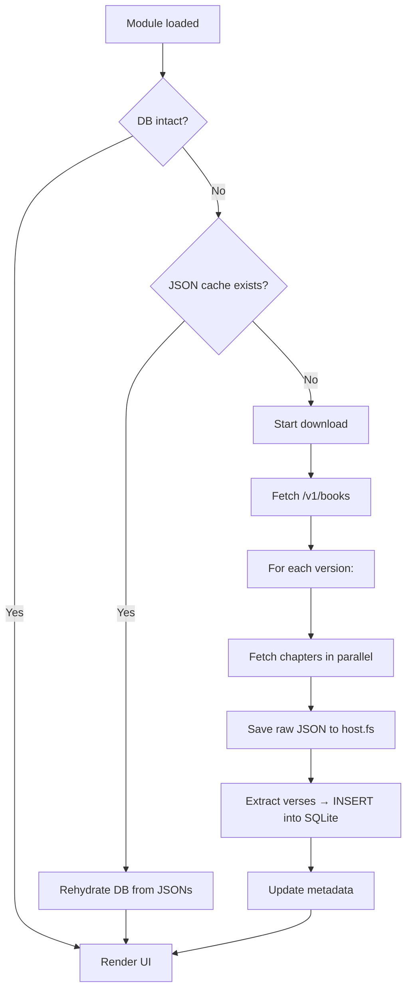

# Bible Module — Architecture Plan

## 1. Overview

Bible module for Lumen with two surfaces:

- **Overlay** (`host.overlay`): operator control interface — book grid,
  navigation, search, verse selection. Detached, standalone window.
- **Presenter** (`host.presentation`): audience output — displays the selected
  text in large font, without navigation elements.

Default versions: **NAA** (Nova Almeida Atualizada), **ARA** (Almeida Revista e
Atualizada), and **NVI** (Nova Versão Internacional). Additional versions may be
added in the future. Internationalized UI (PT, EN, ES). Data is downloaded
from the [midvash API](https://api.midvash.com) and stored locally in SQLite
via `host.data.sqlite()`, with raw JSON cache via `host.fs`.

---

## 2. Directory Structure

```
src/
├── data/
│   ├── downloader.ts          # Parallel download of translations
│   ├── schema.ts              # SQLite migrations
│   ├── store.ts               # Queries and local DB operations
│   └── types.ts               # Bible data types
├── i18n/
│   ├── en.ts
│   ├── pt-BR.ts
│   └── es.ts                  # Spanish support
├── overlay/
│   ├── BibleController.tsx     # Main overlay panel (book grid + reading)
│   ├── BookGrid.tsx            # Periodic-table-style book grid
│   ├── ChapterReader.tsx       # Chapter reader (overlay sidebar)
│   ├── VersionSelector.tsx     # Version selector
│   ├── QuickSearch.tsx         # Quick search by book initial / "gn 1"
│   ├── DownloadProgress.tsx    # Discreet progress bar at the top
│   └── SearchPanel.tsx         # Full-text search panel
├── presenter/
│   └── BibleSlide.tsx          # Presenter slide (large text for the audience)
├── commands.ts                 # Palette command registration
├── i18n.ts
├── main.ts                     # Plugin entry point
└── styles.css
```

---

## 3. SQLite Schema

```sql
-- Migration 1: verses
CREATE TABLE verses (
  id        INTEGER PRIMARY KEY AUTOINCREMENT,
  version   TEXT NOT NULL,            -- 'naa', 'arc', 'ara', 'acf', 'as21', 'aa', 'jfaa'
  book      TEXT NOT NULL,            -- book slug: 'genesis', 'exodus', etc.
  chapter   INTEGER NOT NULL,
  verse     INTEGER NOT NULL,
  text      TEXT NOT NULL,
  UNIQUE(version, book, chapter, verse)
);

CREATE INDEX idx_verses_version_book_chapter
  ON verses(version, book, chapter);

-- Migration 2: metadata
CREATE TABLE metadata (
  key   TEXT PRIMARY KEY,
  value TEXT NOT NULL
);
-- Stores: last_download, versions_downloaded (JSON array), etc.

-- Migration 3: search_index (FTS5)
CREATE VIRTUAL TABLE verses_fts USING fts5(
  text,
  version UNINDEXED,
  book    UNINDEXED,
  chapter UNINDEXED,
  verse   UNINDEXED,
  content=verses,
  content_rowid=id
);

-- Triggers to keep FTS in sync
CREATE TRIGGER verses_ai AFTER INSERT ON verses BEGIN
  INSERT INTO verses_fts(rowid, text, version, book, chapter, verses)
  VALUES (new.id, new.text, new.version, new.book, new.chapter, new.verse);
END;
```

---

## 4. Data Layer

### 4.1. Types (`types.ts`)

```typescript
interface Book {
  id: string;          // slug: 'genesis'
  name: string;        // translated name: 'Genesis'
  chapters: number;    // total chapters
  testament: 'old' | 'new';
}

interface Version {
  id: string;          // 'naa', 'arc', ...
  name: string;        // 'Nova Almeida Atualizada'
  language: string;    // 'pt'
}

interface Chapter {
  version: string;
  book: string;
  number: number;
  verses: (Verse | null)[];  // 1-based index, null = nonexistent
}

interface Verse {
  number: number;
  text: string;
}

interface SearchResult {
  version: string;
  book: string;
  chapter: number;
  verse: number;
  text: string;
  snippet: string;
}
```

### 4.2. Downloader (`downloader.ts`)

- Uses `host.net` to fetch translations from midvash.
- Endpoints:
  - `GET /v1/versions` → list of available versions
  - `GET /v1/books` → list of books (use `?version=naa` — or the endpoint accepts `?language=pt`)
  - `GET /v1/{version}/{book}/{chapter}` → individual chapter
- Strategy:
  1. Fetch book list (1 request).
  2. For each version, fire parallel requests for all chapters.
  3. Use `Promise.allSettled` with concurrency limit (e.g., 20 simultaneous).
  4. Save raw JSON of each chapter in `host.fs` as backup (`{version}/{book}/{chapter}.json`).
  5. Extract verses from JSON and insert in batches into SQLite via `INSERT OR IGNORE`.
  6. Responsiveness: discreet progress bar at the top of the overlay, emitting
     `host.events.emit('download:progress', { version, current, total })`.
- Retry and resilience:
  - Each chapter: 3 attempts with progressive backoff (1s, 3s, 5s).
  - If it fails after 3 attempts, mark as failed and notify the user.
  - **Resumable download**: the JSON saved in `host.fs` serves as a checkpoint.
    On the next run, chapters with existing JSON are skipped (rehydrated
    into the DB locally).
  - If midvash is down, display "Service unavailable" notification and
    offer retry.
- "Redownload" button to force update (clears JSON + DB and downloads fresh).

### 4.3. Store (`store.ts`)

```typescript
// Initialization — checks if DB needs to be rehydrated from JSONs
async function initDB(db: SqliteHandle, fs: FsAPI): Promise<void>

// Download — fetches from midvash, inserts into DB and saves JSON
async function downloadVersion(db: SqliteHandle, net: NetAPI, fs: FsAPI, versionId: string, books: Book[]): Promise<void>
async function downloadAll(db: SqliteHandle, net: NetAPI, fs: FsAPI, versions: string[]): Promise<void>

// Rehydration — if DB is empty but JSON exists, rebuild without downloading
async function rehydrateFromCache(db: SqliteHandle, fs: FsAPI, versionId: string, books: Book[]): Promise<boolean>

// Reading
async function getChapter(db: SqliteHandle, version: string, book: string, chapter: number): Promise<Chapter>
async function getBookList(db: SqliteHandle): Promise<Book[]>

// Search
async function search(db: SqliteHandle, query: string, version?: string): Promise<SearchResult[]>
```

---

## 5. UI / Panels

### 5.1. BibleController (Overlay `presenter.content`)

Slot: `'presenter.content'` — projected via `host.overlay.project("bible-controller", { windowConfig, ... })`

The overlay opens maximized, undecorated, like a standalone app. Layout
split into two columns:

```
┌──────────────────────────────────────────────────────────┐
│  ████████████████░░░░░░░  Downloading NVI... (45%)       │ ← DownloadProgress (only shows during download)
├──────────────────────────────────────────────────────────┤
│  Bible  [NAA ▾]  [🔍 Search...]                          │ ← Top bar
├────────────────────────────┬─────────────────────────────┤
│                            │                             │
│  ┌────┐ ┌────┐ ┌────┐     │  Genesis 1                  │
│  │ Gn │ │ Ex │ │ Lv │     │                             │
│  └────┘ └────┘ └────┘     │  1 In the beginning, God     │
│  ┌────┐ ┌────┐ ┌────┐     │  created the heavens and     │
│  │ Nm │ │ Dt │ │ Js │     │  the earth.                  │
│  └────┘ └────┘ └────┘     │                             │
│  ┌────┐ ┌────┐ ┌────┐     │  2 The earth was formless    │
│  │ Jz │ │ Rt │ │ 1Sm │    │  and empty...                 │
│  └────┘ └────┘ └────┘     │                             │
│  ...               [OT ▼] │  [◀ 1] [2] [3] ... ▶]       │
│                            │                             │
│  Periodic-table-style     │  Selected chapter reader     │
│  book grid                │                              │
│                            │                             │
├────────────────────────────┴─────────────────────────────┤
│   [⏎ Project Genesis 1]  [📋 Copy selection]             │ ← Action bar
└──────────────────────────────────────────────────────────┘
```

**QuickSearch (type-to-filter):**
- Typing any alphanumeric key opens a selector at the top of the overlay.
- Filters books by initial or partial name.
- Accepts commands like `"gn"` → Genesis, `"gn 1"` → Genesis 1.
- If a single character, shows a simplified grid with books starting with that letter.
- Closes when clicking a book or pressing Escape.

**Overlay components:**

| Component | Description |
|------------|-----------|
| `BookGrid` | Grid of buttons with book abbreviations (Gn, Ex, Lv...), filtered by testament (OT/NT) |
| `ChapterReader` | Right sidebar with the selected chapter text, inter-chapter navigation |
| `VersionSelector` | Top dropdown to change active version |
| `QuickSearch` | Quick search by book initial / reference like "gn 1:2" |
| `DownloadProgress` | Discreet top bar during download, visible but not intrusive |
| `SearchPanel` | Full-text search with grouped results |

**Usage flow:**
1. Operator clicks a book in the grid → `ChapterReader` loads chapter 1
2. Or types the book's initial → `QuickSearch` opens suggestions
3. Navigates between chapters in the reader
4. Clicks "Project" → sends text to the presenter

### 5.2. BibleSlide (Presenter `presenter.content`)

Slot: `'presenter.content'` — projected via `host.presentation.project("bible-slide", { version, book, chapter, verses })`

```
┌─────────────────────────────────────┐
│                                     │
│                                     │
│      Genesis 1 — NAA               │ ← Reference (small)
│                                     │
│   1 In the beginning, God created  │
│     the heavens and the earth.     │
│   2 The earth was formless and     │ ← Large, centered text
│     empty; darkness covered        │
│     the deep.                      │
│   3 And God said, "Let there be    │
│     light," and there was light.   │
│                                     │
│                                     │
│                                     │
└─────────────────────────────────────┘
```

- Large font, high contrast, no distractions
- Reference at the top (Genesis 1 — NAA)
- Numbered verses
- Projected on the presenter (audience/projector screen)

---

## 6. Lumen Integration

### 6.1. Overlay (Control)

```typescript
// Open the Bible control interface
host.overlay.project("bible-controller", {
  windowConfig: {
    maximized: true,
    resizable: false,
    decorations: false,
    title: "Bible",
  },
});
```

All operator interaction happens here: browse books, read chapters, search.

### 6.2. Presenter (Public Output)

```typescript
// Project a chapter/verse on the presenter
host.presentation.project("bible-slide", {
  version: "naa",
  book: "genesis",
  bookName: "Genesis",
  chapter: 1,
  verses: [1, 2, 3],   // specific verses or null = entire chapter
  range: "1-3",         // optional label: "vv. 1-3"
});

// Clear the presenter
host.presentation.clear();
```

The presenter shows only clean text, with no navigation UI.

### 6.3. Commands (Command Palette)

| Command | Action |
|---------|------|
| `bible: open` | Open Bible overlay |
| `bible: search [query]` | Open search in the overlay (with prefix) |
| `bible: go-to [book] [chapter]` | Navigate directly to book/chapter in the overlay |
| `bible: project [ref]` | Project reference directly on the presenter |
| `bible: clear` | Clear presenter |

### 6.4. Events (Bus)

- `bible:verse-selected` → `{ version, book, chapter, verse, text }`
  - Allows other modules (e.g., lyric module) to insert verses into projects.
- `bible:projected` → `{ version, book, chapter, verses }`
  - Notifies that something has been projected.

### 6.5. Queue Integration (Verse Actions)

The module registers a queue action via `host.queue.registerAction` that allows
verses to be added to Lumen's playback queue. When the queue reaches the action,
the presenter opens automatically with the pre-configured verse.

```typescript
// Registered once in onload (main window only):
host.queue.registerAction({
  id: 'bible.verse-queue',
  onFire(config) {
    host.presentation.project('bible-slide', { data: config });
  },
});
```

The operator adds verses via a context menu in the `ChapterReader`:

```typescript
// From the context menu callback:
host.queue.addTrigger?.('bible.verse-queue', {
  version: 'nvi',
  book: 'psalms',
  bookName: 'Salmos',
  chapter: 119,
  verse: 3,
  verseText: '...',
  versionDisplayName: 'NVI',
});
```

**Flow:**
```
Surface window                Main window                   Presenter
─────────────                 ───────────                   ─────────
Right-click verse →
"Add to queue" clicked →
queue.addTrigger() ──IPC──→  event listener fires
                              inserts into queue table
                              adds to entries store
                                                           queue advances →
                                                           action.onFire()
                                                           presenter opens ←
```

**Key design decisions:**
- Uses `registerAction`, not `registerTrigger` — the action is entirely
  module-controlled. It does not appear in the queue panel UI.
- The action's `onFire` reads the current presentation settings (font, background,
  color) from the module store at the time of projection.
- The verse entry persists in Lumen's `queue` table alongside regular media
  items, surviving app reloads. On reload, it is restored via the
  `queue-entries-store.loadFromDb()` method.
- The `queue` host object is stored as a plain module-level variable
  (`setModuleQueue` / `getModuleQueue`), not inside Zustand state, to avoid
  performance overhead from reactive subscriptions.

---

## 7. Download and Cache

### 7.1. Download Flow


```mermaid
flowchart TD
    A[Module loaded] --> B{DB intact?}
    B -->|No| C{JSON cache exists?}
    B -->|Yes| G[Render UI]
    C -->|Yes| D[Rehydrate DB from JSONs]
    C -->|No| E[Start download]
    D --> G
    E --> F[Fetch /v1/books]
    F --> H[For each version:]
    H --> I[Fetch chapters in parallel]
    I --> J[Save raw JSON to host.fs]
    J --> K[Extract verses → INSERT into SQLite]
    K --> L[Update metadata]
    L --> G
```

### 7.2. Performance

- ~1,036 chapters per version (NAA/NVI have fewer chapters than ARC/ARA).
- 20 concurrent requests → ~50 seconds per version.
- Each chapter ~2-5 KB → ~3-6 MB per version (~12 MB for NAA + ARA + NVI).
- Raw JSON saved in `host.fs`: same size.
- 3 attempts per chapter with backoff (1s, 3s, 5s).
- Resumable download: JSON in `host.fs` serves as checkpoint.
- Batch inserts of 100 verses → commit per batch.
- Background download, responsive UI with progress bar at the top.
- DB rehydration from JSONs is instantaneous. 
- If midvash fails permanently: "Service unavailable" notification and retry button.

### 7.3. Midvash API Details

- Base URL: `https://api.midvash.com/v1`
- Examples:
  - `GET /v1/versions` → `["naa","arc","ara","acf",...]`
  - `GET /v1/books?version=naa` → book list
  - `GET /v1/{version}/{book}/{chapter}` → chapter
- Cache: Cloudflare immutable for 1 year (`max-age=31536000`), no rate limit, no key.

### 7.4. WindowConfig (Overlay Props)

The Lumen module (`module-overlay-window.tsx`) was modified to support
window configuration via props. Whenever `host.overlay.project()` is called,
the overlay extracts `props.windowConfig` and applies:

```typescript
interface WindowConfig {
  maximized?: boolean;
  resizable?: boolean;
  decorations?: boolean;
  title?: string;
  fullscreen?: boolean;
  width?: number;
  height?: number;
  minWidth?: number;
  minHeight?: number;
}
```

These configs are reapplied on each `project()`.

---

## 8. Internationalization

### 8.1. Languages

| Key | Language |
|-------|--------|
| `en`  | English |
| `pt-BR` | Portuguese (Brazil) |
| `es`  | Spanish |

### 8.2. Strings

```typescript
// en.ts
{
  "bible.title": "Bible",
  "bible.search": "Search",
  "bible.go-to": "Go to...",
  "bible.select-version": "Select Version",
  "bible.downloading": "Downloading {version}...",
  "bible.download-complete": "Download complete",
  "bible.no-results": "No results found",
  // ... book names
  "book.genesis": "Genesis",
  "book.exodus": "Exodus",
  // ...
}
```

---

## 9. Implementation Plan

| Phase | Task | Estimate |
|------|--------|------------|
| 1 | SQLite schema + migrations + store.ts (CRUD + rehydration) | 1 day |
| 2 | Downloader with parallelism, retry, resumable, JSON cache | 1 day |
| 3 | BibleController + BookGrid + QuickSearch + ChapterReader | 1 day |
| 4 | DownloadProgress (top bar) + VersionSelector | 0.5 day |
| 5 | BibleSlide (presenter) + overlay → presenter flow | 0.5 day |
| 6 | SearchPanel with FTS5 | 0.5 day |
| 7 | i18n (es + book names in PT/EN/ES) | 0.5 day |
| 8 | Commands + Bus events + error handling + notifications | 0.5 day |
| **Total** | | **~5.5 days** |

---

## 10. Technical Notes

- The SDK is NOT an external npm package — it is embedded in the Lumen source code.
- `host.data.sqlite()` returns a lazy `SqliteHandle` (opens on first call). Only call after `onload`.
- `host.settings` is **in-memory only** (does not persist). Use `host.data.json` for persistent settings if needed.
- Each module has an isolated data scope. SQLite is module-specific.
- Network URLs must be allowed in `manifest.json` → `permissions.network`.
- The Lumen file `module-overlay-window.tsx` was modified to support
  `windowConfig` via overlay props. This modification is required for
  the Bible module to function.